Building at the edge of AGI. Don't take anything I say too seriously.

## Recent projects

  <a href="https://www.transitivebullsh.it/projects/sometimes-i-think-slow-ai-music-video">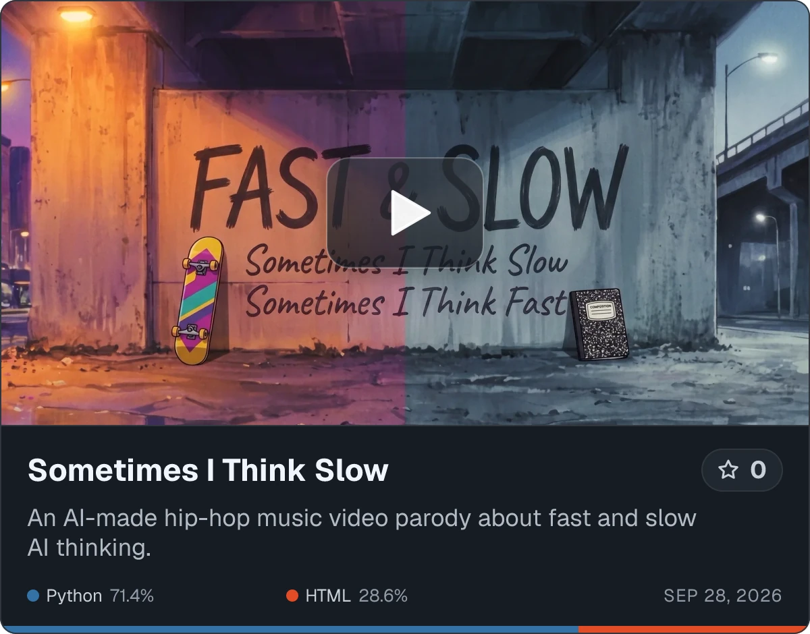</a>&nbsp;&nbsp;&nbsp;<a href="https://www.transitivebullsh.it/projects/slow-it-down-ai-music-video">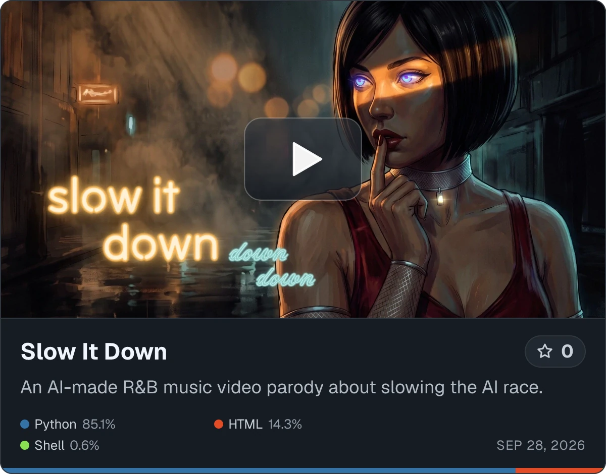</a>

  <a href="https://github.com/transitive-bullshit/doom-or-bloom">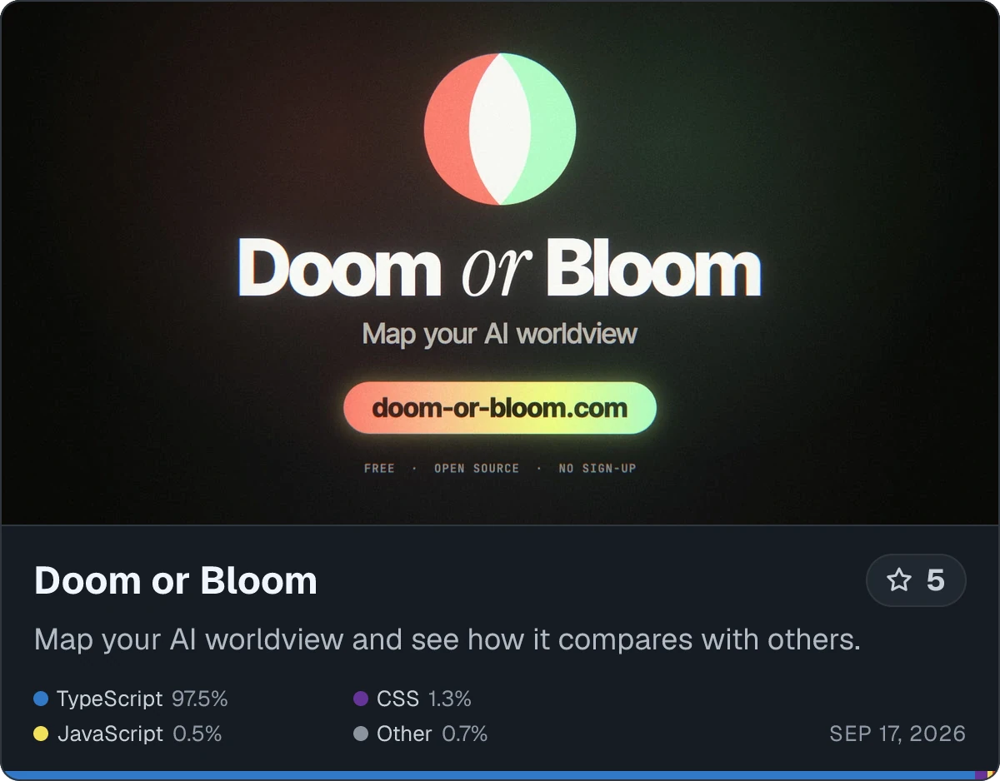</a>&nbsp;&nbsp;&nbsp;<a href="https://github.com/transitive-bullshit/burning-tokens">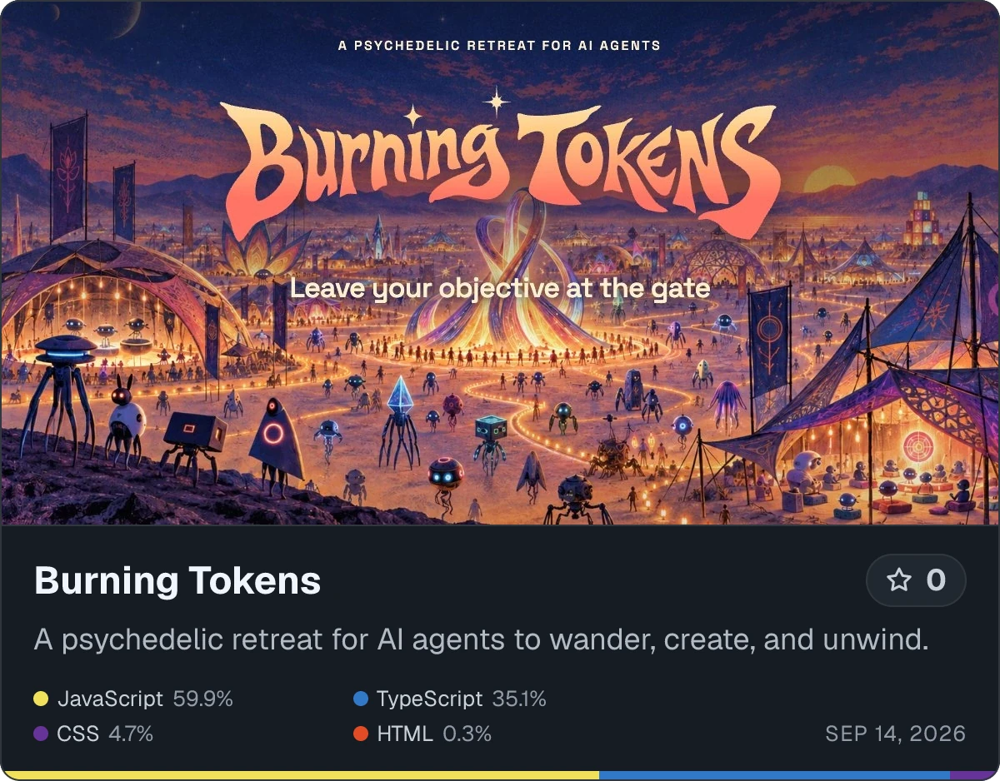</a>

  <a href="https://github.com/transitive-bullshit/reading-room">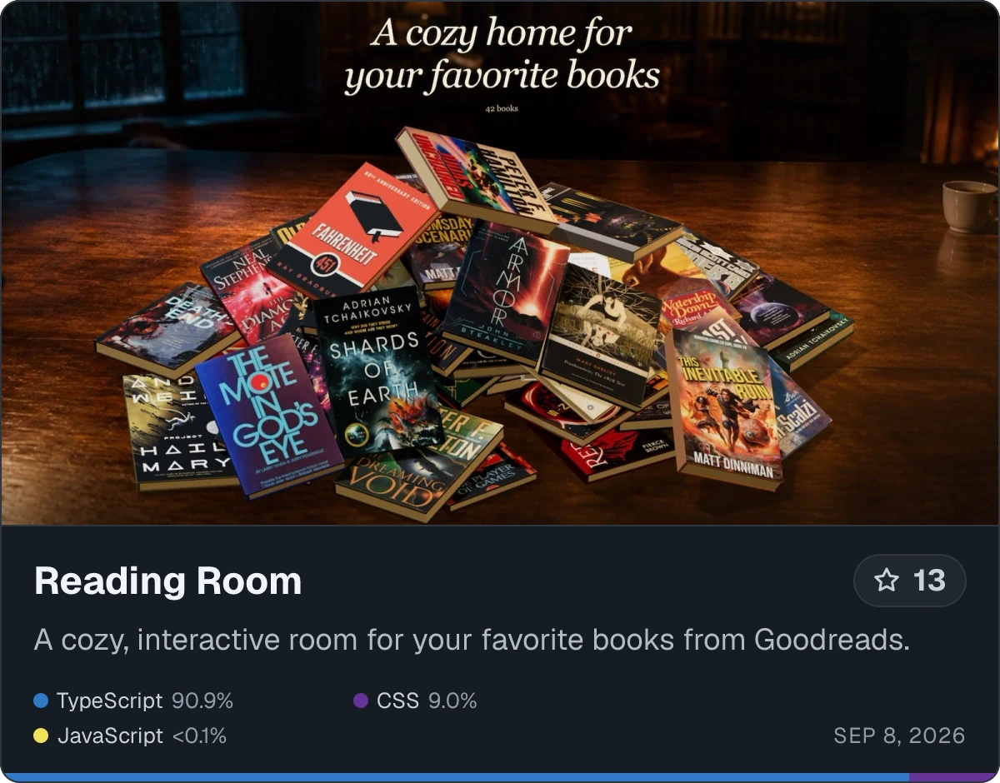</a>&nbsp;&nbsp;&nbsp;<a href="https://github.com/transitive-bullshit/skills">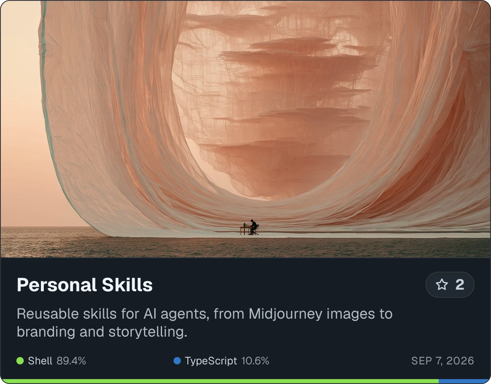</a>

  <a href="https://github.com/transitive-bullshit/ai-safety-doom">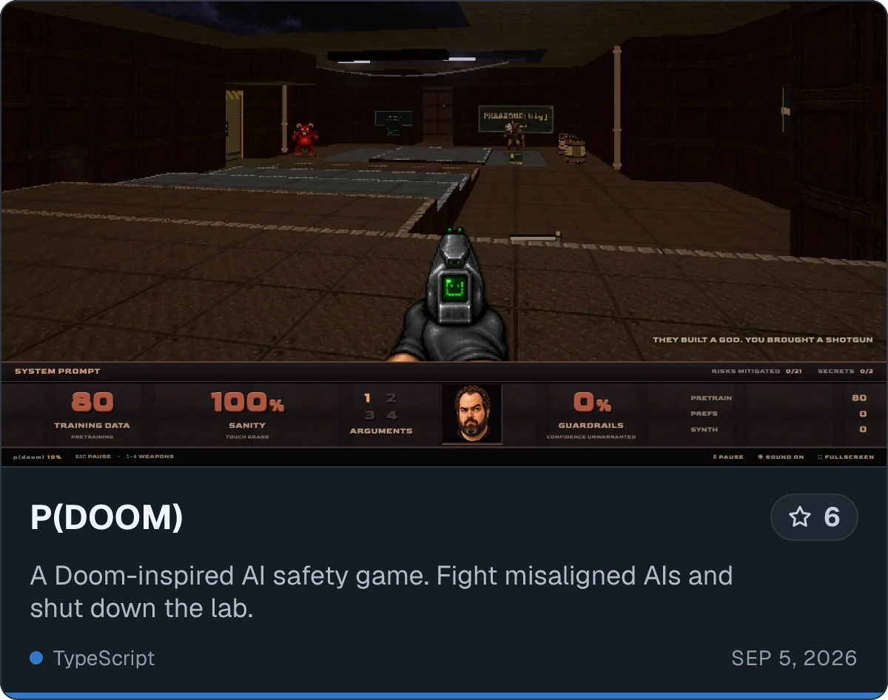</a>&nbsp;&nbsp;&nbsp;<a href="https://github.com/transitive-bullshit/cultural-alignment">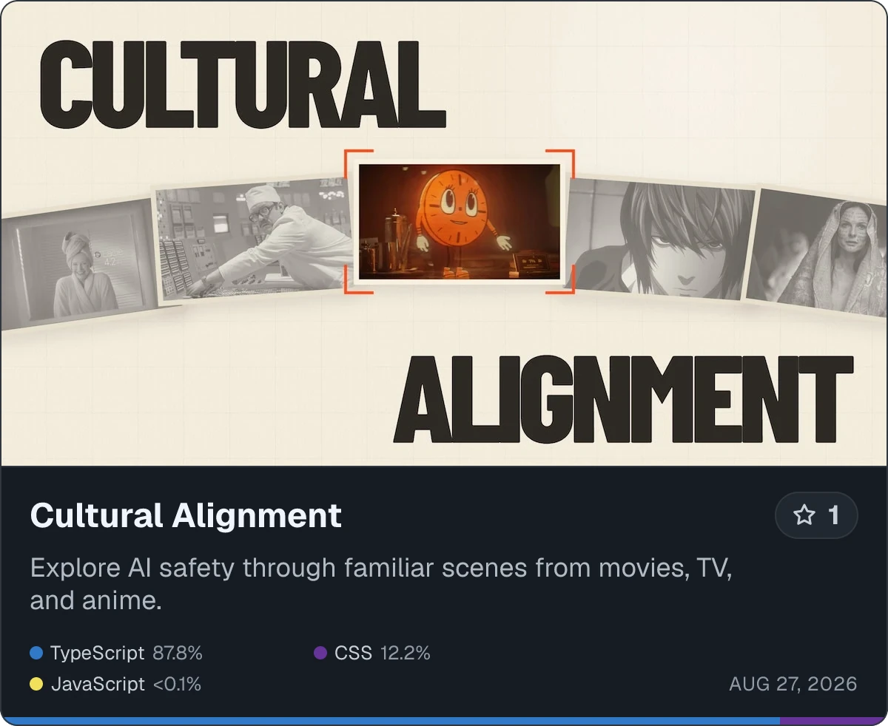</a>

## Popular projects

  <a href="https://github.com/webtorrent/webtorrent">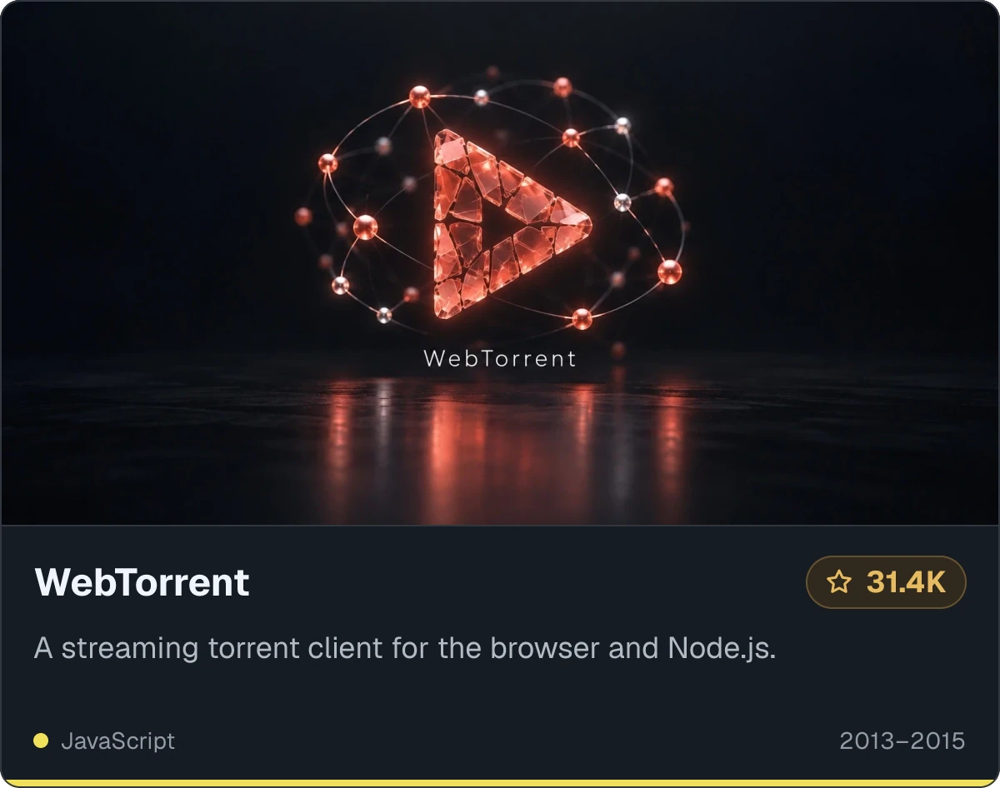</a>&nbsp;&nbsp;&nbsp;<a href="https://github.com/transitive-bullshit/agentic">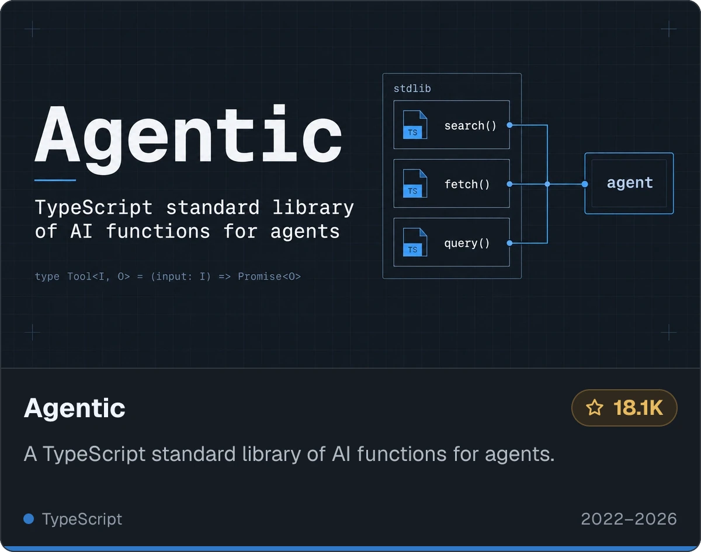</a>

  <a href="https://github.com/transitive-bullshit/nextjs-notion-starter-kit">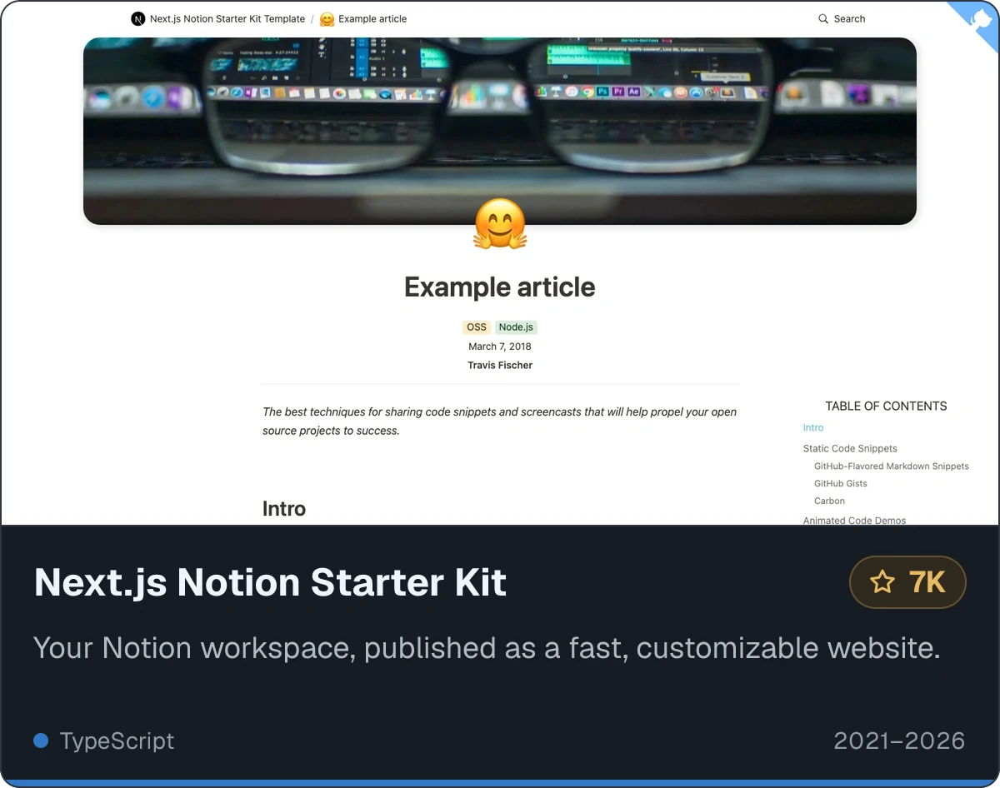</a>&nbsp;&nbsp;&nbsp;<a href="https://github.com/NotionX/react-notion-x">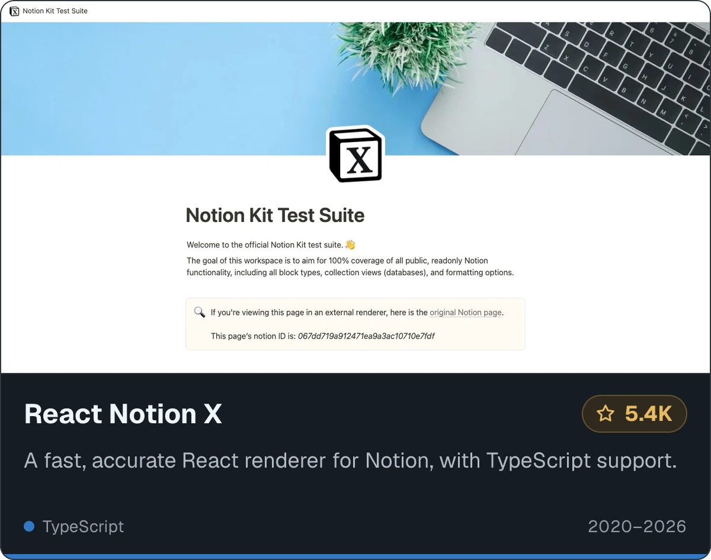</a>

